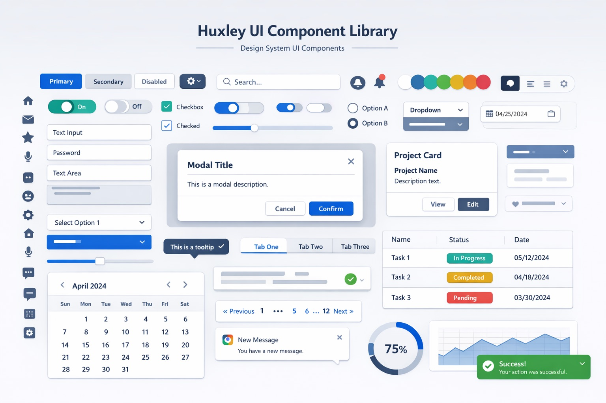

# huxley-ui

<p align="center">
  
</p>

디자인 시스템 스펙이 반영된 UI 컴포넌트 레퍼런스 구현체입니다.

새 프로젝트 시작 시 컴포넌트를 0에서 만들지 않고, 여기서 가져가서 쓰면 됩니다. 가져간 후에는 프로젝트 상황에 맞게 자유롭게 수정하세요.

## 사용법

1. [문서 사이트](https://huxley-ui.vercel.app)에서 필요한 컴포넌트 선택
2. 코드 복사 → 내 프로젝트에 붙여넣기
3. 프로젝트에 맞게 수정

### 전제 조건

- Tailwind CSS v4
- 디자인 토큰 CSS (`packages/ui/tailwind/` 하위 파일들을 프로젝트에 복사)

## 컴포넌트 목록

| 컴포넌트 | 설명 |
|----------|------|
| Accordion | 접기/펼치기 패널 |
| Alert Dialog | 확인/취소가 필요한 알림 |
| Avatar | 사용자 프로필 이미지 |
| Button | 버튼 (아이콘 버튼, 로딩 상태 지원) |
| Card | 카드 컨테이너 |
| Checkbox | 체크박스 |
| Checkbox Group | 체크박스 그룹 |
| Combobox | 검색 가능한 드롭다운 |
| Dialog | 모달 다이얼로그 |
| Field | 폼 필드 (label, description, error) |
| Menu | 컨텍스트 메뉴 |
| Popover | 팝오버 |
| Radio | 라디오 버튼 그룹 |
| Select | 드롭다운 선택 |
| Separator | 구분선 |
| Slider | 슬라이더 |
| Stack | Flex 레이아웃 컨테이너 |
| Switch | 토글 스위치 |
| Text Field | 텍스트 입력 필드 |
| Toast | 토스트 알림 |

## Playground — AI 기반 UI 프로토타이핑

문서 사이트의 [Playground](https://huxley-ui.vercel.app/playground)에서 자연어로 UI를 설명하면, huxley-ui 컴포넌트로 구성된 화면을 즉시 생성합니다.

```
"로그인 폼 만들어줘" → TextField + Button 조합의 실제 렌더링 결과
```

### 어떻게 동작하는가

`packages/json-render`가 이를 가능하게 합니다:

1. **catalog** — 각 컴포넌트의 props와 설명을 Zod 스키마로 정의. AI가 "어떤 컴포넌트를 쓸 수 있는지" 알게 해줌
2. **registry** — catalog의 스키마와 실제 React 컴포넌트를 연결. AI가 생성한 JSON spec을 화면에 렌더링

```
자연어 프롬프트
  → catalog 기반으로 AI에게 사용 가능한 컴포넌트 전달
  → AI가 JSON spec 생성 (컴포넌트 트리)
  → registry가 JSON → React 렌더링
```

### 활용

- 코드 작성 전에 컴포넌트 조합을 빠르게 시험
- "이 화면에 어떤 컴포넌트가 필요한지" 감 잡기
- 비개발자도 자연어로 UI 프로토타입 확인 가능

## 기술 스택

- [Base UI](https://base-ui.com/) — 헤드리스 UI 프리미티브 (접근성 내장)
- [Tailwind CSS v4](https://tailwindcss.com/) — 스타일링
- [class-variance-authority](https://cva.style/) — variant 관리
- TypeScript strict mode

## 프로젝트 구조

```
packages/
  ui/                # 컴포넌트 라이브러리
    components/      # 컴포넌트 파일 (하나씩 복사해서 사용)
    tailwind/        # 디자인 토큰 (색상, 타이포, 그림자)
    utils/           # cn() 유틸리티
  json-render/       # AI 기반 UI 생성 (playground용)
apps/
  docs/              # 문서 사이트 (Next.js)
```

## 로컬 개발

```bash
bun install
bun run dev       # 문서 사이트 로컬 실행
bun run check     # 린트
```

## FAQ

**Q. npm 패키지로 설치하는 게 아닌가요?**

아닙니다. 각 프로젝트에 코드를 복사해서 넣는 방식입니다. 이렇게 하면:
- 프로젝트별로 자유롭게 커스터마이징 가능
- 패키지 버전 업데이트로 인한 breaking change 없음
- MVP 단계에서 API가 바뀌어도 기존 프로젝트에 영향 없음

안정화 이후 패키지화 여부는 별도 논의합니다.
